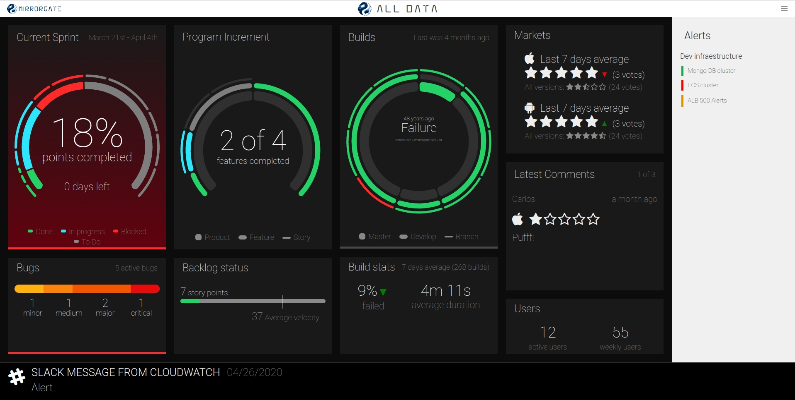

MirrorGate is a WallBoard application meant to give teams fast feedback in all the different areas related to software development.

## ¿Why that name?

MirrorGate is meant to display relevant information about how your software looks like from every perspective, from the planing to the user feedback. So it's the mirror where teams can see their work reflected, helping them to perform self-criticism and contiuous improvement. It aims to improve software quality and time-to-market by making the team aware of how the software they're developing and their process looks like.

That said, to be honest, it all comes from this dialog from `The Never Ending Story`:

* Engywook: Next is the Magic Mirror Gate. Atreyu has to face his true self.
* Falcor: So what? That won't be too hard for him.
* Engywook: Oh, that's what everyone thinks! But kind people find out that they are cruel. Brave men discover that they are really cowards! Confronted by their true selves, most men run away screaming!

## Functionality

Right now MirrorGate offers information about:
- Sprint advance status and backlog refinement.
- Build status per repository
- Marketplace feedback for mobile applications both in itunes and PlayStore

We expect to be adding much more information in the near future so keep tuned.

Aditionally MirrorGate offers a backoffice aplication where dashboards can be configured.

# Architecture

In order to operate, the MirrorGate requires several components:

- Main MirrorGate aplication: tipically executed by using the `bbva-ae/mirrorgate` docker container.
- MongoDB database. Should be binded to the aplication by using the `SPRING_DATA_MONGODB_URI` env variable (for example: `SPRING_DATA_MONGODB_URI=mongodb://localhost:27017/dashboarddb`)
- [Collectors](https://github.com/BBVA?utf8=%E2%9C%93&q=mirrorgate%20collector&type=&language=): collectors are components encharged of pushing information to the application. Currently there are the following collectors:
    - Jenkins plugin: is a plugin for jenkins CI server that pushes builds information.
    - Jira collector: is an standlone aplication that polls Jira server for changes every configurable ammount of time.
    - Market collectors: are standalone process that polls the smartphone applications marketplaces for user reviews.

## Security

MirrorGate currently doesn't have a security layer build in. If you want to secure it, you will have to put it behind a reverse proxy like NginX and rely on perimetral security. Ensure to propagate the authenticated user name by using the X-Forwarded-User header so that changes performed to dashboards configuration through the backoffice get the user tracked.

# Building and executing locally

## Build Dependencies

You need the following dependencies installed in order to build the project:

- [nodejs >= 6](https://nodejs.org)
- [jdk >= 8](http://openjdk.java.net/)
- [docker](https://www.docker.com/)
- [docker-compose](https://docs.docker.com/compose/): optional but strongly recomended to be able to execute some of the scripts.

## Project Structure

Contains folders for each of the modules:
- [mirrorgate-dashboard](./mirrorgate-dashboard/readme.md): contains the front-end sources.
- [mirrorgate-backoffice](./mirrorgate-backoffice/README.md): contains danshboards administration application.
- [mirrorgate-api](./mirrorgate-api/Readme.md): contains de api (backend) sources.
- [mirrorgate-core](./mirrorgate-core/Readme.md): contains the core library used by the api and the collectors
- [docker](./docker/README.md): contains utilities to build a MirrorGate docker image
- [tests](./tests/README.md): contains utilities to put all the pieces together and execute them as a whole while developing.

Check each of this folders for instructions on how to build, deploy and run each module.

## How to execute

To execute MirrorGate locally:

0. Ensure you have all the build dependencies installed
1. Clone this repo
2. Execute `scripts/buildAndRun.sh`
3. Wait some time until the message **Tomcat started on port(s): 8080** appears.
3. Open [http://localhost:8080/mirrorgate/backoffice/index.html](http://localhost:8080/mirrorgate/backoffice/index.html) to access the wallboards backoffice.
4. You should be able to navigate through the mock dashboards.
5. Attempt to run some of the collectors (i.e. Jira) to be able to populate some information inside the database.

# Contributing

Please read the [contributing guide](./CONTRIBUTING.md)

# Credit

This project is inspired by [CapitalOne's Hygieia](https://github.com/capitalone/Hygieia).
